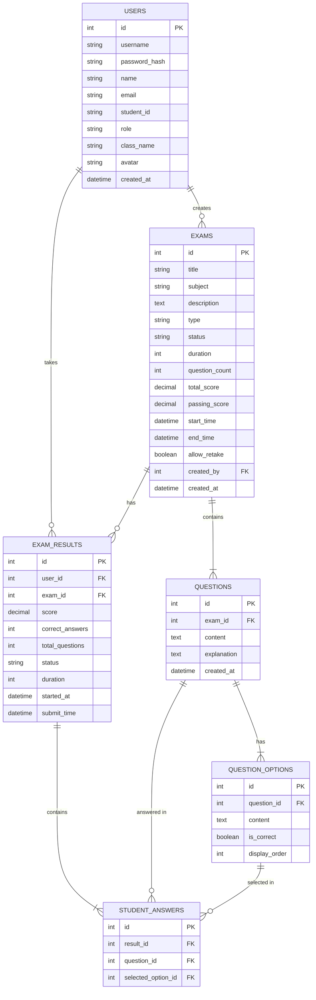

# Thiết kế Cơ sở dữ liệu cho Hệ thống Thi Trực tuyến PTIT (PExam)

> **Lưu ý:** Hiện tại dự án đang sử dụng **Spring Boot Mock Backend** không cần một cơ sở dữ liệu thực tế. Tuy nhiên, thiết kế dưới đây là thiết kế Cơ sở dữ liệu quan hệ (RDBMS - có thể áp dụng cho MySQL hoặc PostgreSQL) chuẩn hóa phù hợp nếu bạn muốn triển khai hệ thống với hệ quản trị cơ sở dữ liệu thật.

Dựa trên cấu trúc dữ liệu ban đầu trong file `js/data.js` và yêu cầu của dự án, thiết kế dưới đây đảm bảo tính toàn vẹn dữ liệu, khả năng mở rộng và hiệu suất.

## 1. Sơ đồ thực thể liên kết (ERD)

## 2. Chi tiết các bảng (Data Dictionary)

### 2.1. Bảng `users` (Người dùng)
Lưu trữ thông tin tài khoản của sinh viên và giảng viên (admin).

| Tên cột | Kiểu dữ liệu | Khóa | Ràng buộc | Mô tả |
| --- | --- | --- | --- | --- |
| `id` | INT | PK | AUTO_INCREMENT | ID duy nhất của người dùng |
| `username` | VARCHAR(50) | | UNIQUE, NOT NULL | Tên đăng nhập |
| `password_hash` | VARCHAR(255) | | NOT NULL | Mật khẩu đã được mã hóa (bcrypt/argon2) |
| `name` | VARCHAR(100) | | NOT NULL | Họ và tên đầy đủ |
| `email` | VARCHAR(100) | | UNIQUE, NOT NULL | Email hệ thống (VD: @ptit.edu.vn) |
| `student_id` | VARCHAR(20) | | UNIQUE, NULLABLE | Mã sinh viên (NULL nếu là admin) |
| `role` | ENUM | | DEFAULT 'student' | Vai trò: `student` hoặc `admin` |
| `class_name` | VARCHAR(50) | | NULLABLE | Lớp tín chỉ/Lớp hành chính |
| `avatar` | VARCHAR(255) | | NULLABLE | Đường dẫn ảnh đại diện / Chữ cái đại diện |
| `created_at` | TIMESTAMP | | DEFAULT CURRENT_TIMESTAMP | Thời gian tạo tài khoản |

### 2.2. Bảng `exams` (Kỳ thi / Đề thi)
Lưu trữ thông tin chung về một bài thi.

| Tên cột | Kiểu dữ liệu | Khóa | Ràng buộc | Mô tả |
| --- | --- | --- | --- | --- |
| `id` | INT | PK | AUTO_INCREMENT | ID đề thi |
| `title` | VARCHAR(255) | | NOT NULL | Tiêu đề bài thi |
| `subject` | VARCHAR(100) | | NOT NULL | Môn học |
| `description` | TEXT | | NULLABLE | Mô tả nội dung bài thi |
| `type` | ENUM | | DEFAULT 'practice' | Loại bài thi: `practice`, `midterm`, `final` |
| `status` | ENUM | | DEFAULT 'draft' | Trạng thái: `draft`, `scheduled`, `open`, `completed` |
| `duration` | INT | | NOT NULL | Thời gian làm bài (tính bằng phút) |
| `question_count` | INT | | NOT NULL | Số lượng câu hỏi của đề thi |
| `total_score` | DECIMAL(5,2) | | DEFAULT 10.0 | Tổng điểm tối đa |
| `passing_score` | DECIMAL(5,2) | | DEFAULT 5.0 | Điểm đạt yêu cầu |
| `start_time` | DATETIME | | NULLABLE | Thời gian bắt đầu mở bài thi |
| `end_time` | DATETIME | | NULLABLE | Thời gian kết thúc bài thi |
| `allow_retake` | BOOLEAN | | DEFAULT FALSE | Cho phép làm lại hay không |
| `created_by` | INT | FK | REFERENCES `users(id)` | ID admin tạo đề thi |
| `created_at` | TIMESTAMP | | DEFAULT CURRENT_TIMESTAMP | Thời gian tạo đề thi |

### 2.3. Bảng `questions` (Câu hỏi)
Lưu trữ nội dung câu hỏi thuộc từng đề thi.

| Tên cột | Kiểu dữ liệu | Khóa | Ràng buộc | Mô tả |
| --- | --- | --- | --- | --- |
| `id` | INT | PK | AUTO_INCREMENT | ID câu hỏi |
| `exam_id` | INT | FK | REFERENCES `exams(id)` | Thuộc bài thi nào |
| `content` | TEXT | | NOT NULL | Nội dung câu hỏi |
| `explanation` | TEXT | | NULLABLE | Giải thích đáp án đúng |
| `created_at` | TIMESTAMP | | DEFAULT CURRENT_TIMESTAMP | Thời gian tạo |

### 2.4. Bảng `question_options` (Các lựa chọn đáp án)
Lưu trữ các đáp án A/B/C/D cho câu hỏi, được chuẩn hóa ra bảng riêng để dễ query và trộn đáp án (shuffle option) nếu cần.

| Tên cột | Kiểu dữ liệu | Khóa | Ràng buộc | Mô tả |
| --- | --- | --- | --- | --- |
| `id` | INT | PK | AUTO_INCREMENT | ID đáp án |
| `question_id` | INT | FK | REFERENCES `questions(id)`| Thuộc câu hỏi nào |
| `content` | TEXT | | NOT NULL | Nội dung của đáp án (VD: \
) |
| `is_correct` | BOOLEAN | | DEFAULT FALSE | Là đáp án đúng hay sai? |
| `display_order` | INT | | DEFAULT 0 | Thứ tự hiển thị mặc định (0,1,2,3) |

*Lưu ý: Nếu sử dụng cơ sở dữ liệu hỗ trợ JSON tốt như MySQL 5.7+ hoặc PostgreSQL, có thể gộp bảng này vào bảng `questions` thành trường `options` dạng JSON (như thiết kế frontend ở file `data.js`) để tối giản cấu trúc.*

### 2.5. Bảng `exam_results` (Kết quả thi của sinh viên)
Lưu trữ kết quả mỗi lần nộp bài của sinh viên.

| Tên cột | Kiểu dữ liệu | Khóa | Ràng buộc | Mô tả |
| --- | --- | --- | --- | --- |
| `id` | INT | PK | AUTO_INCREMENT | ID kết quả |
| `user_id` | INT | FK | REFERENCES `users(id)` | Thuộc sinh viên nào |
| `exam_id` | INT | FK | REFERENCES `exams(id)` | Của bài thi nào |
| `score` | DECIMAL(5,2) | | NOT NULL | Điểm số đạt được (vd: 8.67) |
| `correct_answers` | INT | | NOT NULL | Số câu trả lời đúng |
| `total_questions` | INT | | NOT NULL | Tổng số câu hỏi đã làm |
| `status` | ENUM | | DEFAULT 'completed' | Trạng thái làm bài: `in_progress`, `completed` |
| `duration` | INT | | NULLABLE | Thời gian đã dùng để làm (giây/phút) |
| `started_at` | DATETIME | | NULLABLE | Thời gian bắt đầu làm bài |
| `submit_time` | DATETIME | | DEFAULT CURRENT_TIMESTAMP | Thời gian nộp bài |

### 2.6. Bảng `student_answers` (Chi tiết câu rả lời chọn mức câu hỏi)
Lưu trữ chi tiết các đáp án mà sinh viên đã chọn (phục vụ chức năng xem lại bài làm theo chi tiết từng câu).

| Tên cột | Kiểu dữ liệu | Khóa | Ràng buộc | Mô tả |
| --- | --- | --- | --- | --- |
| `id` | INT | PK | AUTO_INCREMENT | ID câu rả lời học sinh |
| `result_id` | INT | FK | REFERENCES `exam_results(id)` | Thuộc lần nộp bài nào |
| `question_id` | INT | FK | REFERENCES `questions(id)` | Câu hỏi nào |
| `selected_option_id`| INT | FK | REFERENCES `question_options(id)` | Đáp án sinh viên đã chọn |

*Lưu ý: Giống như `question_options`, bảng này có thể được tối ưu thành một mảng số nguyên lưu trong trường `answers` dạng JSON của bảng `exam_results` nếu muốn làm giống hệt `data.js` hiện tại.*

---

## Các chỉ mục (Indexes) đề xuất để tối ưu hiệu năng:
1. `users`: B-Tree index cho `email` và `username`.
2. `exams`: Index cho trường `status` và `start_time` để lấy danh sách sinh viên sắp tới nhanh hơn.
3. `exam_results`: Composite index trên (`user_id`, `exam_id`) để truy xuất nhanh kết quả của một user với bài thi cụ thể.
